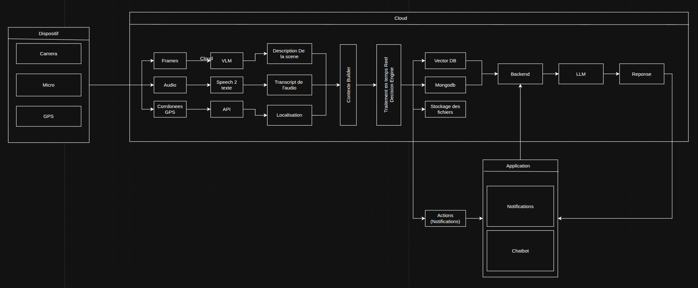

# Personal Assistant PIN


Small multimodal personal-assistant prototype built around Kafka, Spark, and a Groq-powered decision engine.

## Overview

This project contains:

- A Kafka producer that publishes context events to the `contextBuilder` topic
- A Kafka consumer used to inspect messages from that topic
- A decision engine that sends assembled context to an LLM and returns a structured decision
- A Docker Compose setup for Kafka, Kafka UI, and Spark services

## Project Structure

```text
.
├── compose.yaml
├── consumer.py
├── producer.py
├── requirements.txt
└── Decision_engine/
    ├── decision_engine.py
    ├── prompts.py
    ├── read_kafka.ipynb
    └── test_connection.ipynb
```

## Requirements

- Python 3.10+
- Docker and Docker Compose
- A Groq API key

## Environment Variables

Create a `.env` file in the project root with:

```env
GROQ_API_KEY=your_groq_api_key
```

## Installation

```bash
python -m venv .venv
source .venv/bin/activate
pip install -r requirements.txt
```

Note: the current `requirements.txt` only includes `kafka`. If you want to run the decision engine, you will also need its Python dependencies such as `pydantic`, `langchain-core`, and `langchain-groq`.

## Start Infrastructure

```bash
docker compose up -d
```

Available services:

- Kafka broker: `localhost:29092`
- Kafka UI: `http://localhost:8090`
- Spark Master UI: `http://localhost:8080`
- Spark Worker UI: `http://localhost:8081`

## Run the Kafka Demo

Send a sample event:

```bash
python producer.py
```

Read events from Kafka:

```bash
python consumer.py
```

## Use the Decision Engine

The decision engine exposes the `decide_activity(context)` function in [Decision_engine/decision_engine.py](/home/adnane/Desktop/S2-BDIA-2/Personal Assistant PIN/Decision_engine/decision_engine.py).

Example:

```python
from Decision_engine.decision_engine import decide_activity

context = {
    "context_id": "ctx_001",
    "user_id": "user_001",
    "vision": {
        "objects": ["ordinateur", "bureau"],
        "scene_description": "Utilisateur assis devant un ordinateur.",
        "confidence": 0.86
    },
    "audio": {
        "transcript": "Nous devons finaliser le pipeline VLM cette semaine.",
        "keywords": ["pipeline VLM", "deadline"],
        "confidence": 0.80
    }
}

result = decide_activity(context)
print(result)
```

## Notes

- `producer.py` and `consumer.py` use `localhost:29092`, which matches the external Kafka listener from `compose.yaml`
- The LLM prompt and output schema are defined in [Decision_engine/prompts.py](/home/adnane/Desktop/S2-BDIA-2/Personal Assistant PIN/Decision_engine/prompts.py) and [Decision_engine/decision_engine.py](/home/adnane/Desktop/S2-BDIA-2/Personal Assistant PIN/Decision_engine/decision_engine.py)
- Jupyter notebooks under `Decision_engine/` appear to be for local testing and experimentation
